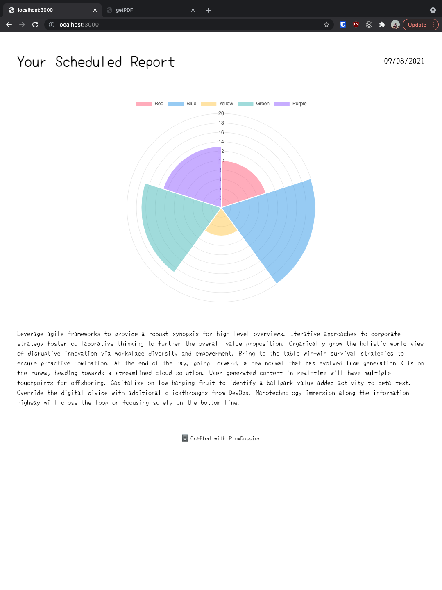
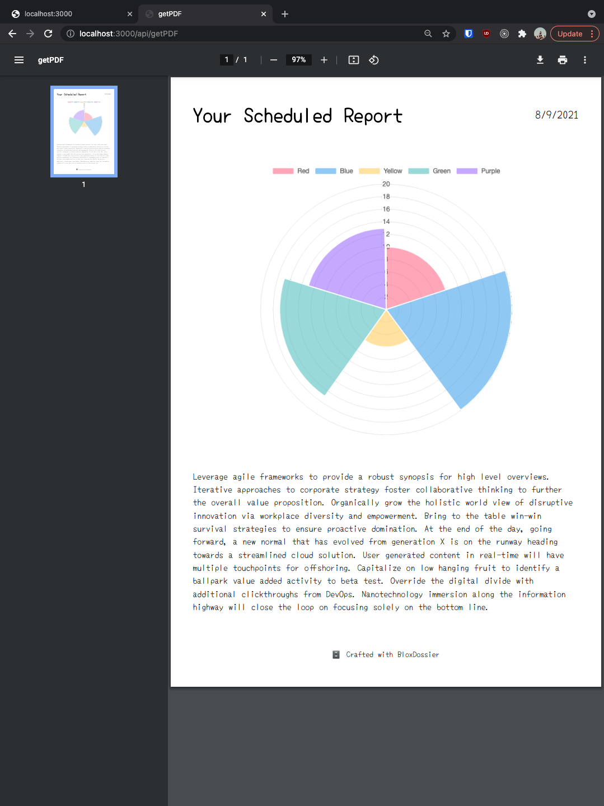

# BloxDossier


_Web Render_


_Print PDF_

### Usage

1. Run the development server:

```
yarn dev
```

2. Open http://localhost:3000 to see the rendered page.
3. To show the print preview, hit `ctrl+P` or `command+P`.

API routes can be accessed on http://localhost:3000/api/{endpoint}.

To get a formatted print preview, access http://localhost:3000/api/getPDF

Framework is powered by [Next.js](https://nextjs.org/). Headless Node.js API is powered by [puppeteer](https://pptr.dev/).
